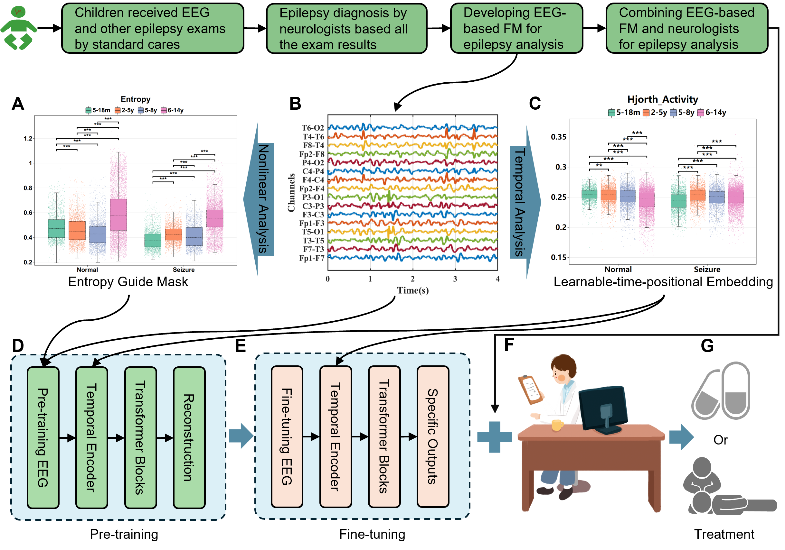

# M4CEA_Project
This is the implementation of our submission "M4CEA: A Knowledge-guided Foundation Model for Childhood Epilepsy Analysis".

[](https://doi.org/10.5281/zenodo.15331060)

The pre-trained weight is available at: [Here](https://pan.baidu.com/s/1rSBjt3_ojaITwbyfKxf33Q?pwd=fg3s)


## Abstract
Existing electroencephalogram (EEG)-based deep learning models are mainly designed for single or several specific tasks in childhood epilepsy analysis, which limits the perceptual capabilities and generalisability of the model. Recently, Foundation Models (FMs) achieved significant success in medical analysis, motivating us to explore the capability of FMs in childhood epilepsy analysis. The objective is to construct a FM with strong generalization capability on multi-tasking childhood epilepsy analysis. To this end, we propose a knowledge-guided foundation model for childhood epilepsy analysis (M4CEA) in this paper. The main contributions of the M4CEA are using the knowledge-guided mask strategy and the temporal embedding of the temporal encoder, which allow the model to effectively capture multi-domain representations of childhood EEG signals. Through pre-training on an EEG dataset with more than 1,000 hours childhood EEG recording, and performance fine-tuning, the developed M4CEA model can achieve promising performance on 8 downstream tasks in childhood epilepsy analysis, including artifact detection, onset detection, seizure type classification, childhood epilepsy syndrome classification, hypoxic-ischaemic encephalopathy (HIE) grading, sleep stage classification, epileptiform activity detection and spike-wave index (SWI) quantification. Taking HUH (Helsinki University Hospital) seizure detection task as an example, our model shows 9.42\% improvement over LaBraM (a state-of-the-art Large Brain foundation Model for EEG analysis) in Balanced Accuracy.

## Environment Set Up
Install required packages:
```bash
conda create -n M4CEA python=3.9
conda activate M4CEA
conda install pytorch==1.13.0 torchvision==0.14.1 torchaudio==0.13.1 pytorch-cuda=11.7 -c pytorch -c nvidia
conda install tensorboardX
pip install -r requirements.txt
```
## Run Experiments
### Prepare pre-training data
You should transfer raw EEG files (such as .cnt, .edf, .bdf, and so on) into pkl-format files using the example code in MFDE/extract_MFDE.py. Notably, you can also write your own codes for preprocessing EEG data. Make sure that the preprocessing is consistent with that of our paper, that is, filtering between 0.5 Hz and 70 Hz, notch filtering of 50 Hz.
### Train for pre-training
The model is pre-trained by Pretrain/pretrain_main.py. Notably, you are encouraged to try different hyperparameters in Pretrain/pretrain_config.py, such as the learning rate and warmup_epochs.
### Train for fine-tuning
The model is fine-tuned by Finetune/finetune_main.py. Before fine-tuning, refer the code in Finetune/finetune_chzu_onset_type_dataloader.py to preprocess the downstream datasets as well as split data into training, validation, and test set. Notably, you are also encouraged to try different hyperparameters in Finetune/finetune_config.py. In fine-tuning stage, we choose 42, 2024, 3407, 4399, 114514 as randoms seeds.
## TODO
**IF YOU HAVE ANY PROBLEM, PLEASE CONTACT ymfeng@hdu.edu.cn OR COMMIT ISSUES**


